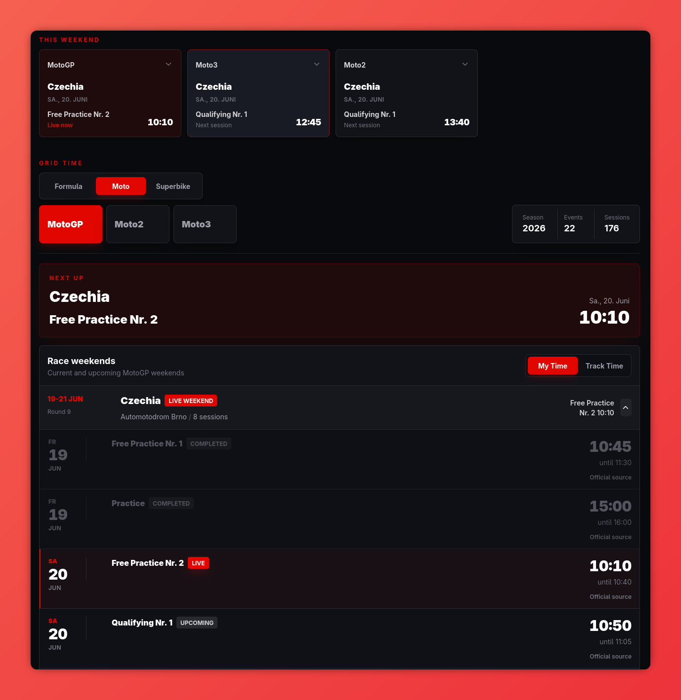

# Grid Time

Grid Time aggregates motorsport race schedules and exposes them through a Symfony API and Nuxt web application.



Supported series:

- Formula 1, Formula 2 and Formula 3
- MotoGP, Moto2 and Moto3
- WorldSBK

## Requirements

- PHP 8.5+
- PostgreSQL
- Composer
- Bun

Configure `APP_SECRET`, `API_KEY_PEPPER` and `CORS_ALLOW_ORIGIN` for Symfony. Configure PostgreSQL with `DATABASE_HOST`, `DATABASE_PORT`, `DATABASE_NAME`, `DATABASE_USER`, `DATABASE_PASSWORD`, `DATABASE_SERVER_VERSION` and `DATABASE_CHARSET`. The Nuxt server additionally requires `NUXT_INTERNAL_API_BASE` and `NUXT_FRONTEND_API_KEY`.

## Container images

Both Dockerfiles use the repository root as their build context. Build them from
the repository root:

```bash
docker build -f docker/build/backend/Dockerfile -t grid-time-backend .
docker build -f docker/build/frontend/Dockerfile --target production -t grid-time-frontend .
```

Runtime secrets and service URLs must be passed as container environment
variables; they are intentionally excluded from the image build context.

## Backend setup

```bash
cd backend
composer install
php bin/console doctrine:migrations:migrate --no-interaction
```

All schedule timestamps are stored in UTC. Scrapers are idempotent and can be run repeatedly.

## Schedule scrapers

Run commands from `backend/`. Every scraper accepts `--year`; it defaults to `2026`.

Run every currently supported schedule scraper at once:

```bash
php bin/console app:scrape:all --year=2026
```

The combined command runs Formula 1, Formula 2, Formula 3, MotoGP, Moto2, Moto3 and WorldSBK. It continues if one series fails and returns a failure status after all series have been attempted.

| Series    | Command                                         |
|-----------|-------------------------------------------------|
| Formula 1 | `php bin/console app:scrape:f1 --year=2026`     |
| Formula 2 | `php bin/console app:scrape:f2 --year=2026`     |
| Formula 3 | `php bin/console app:scrape:f3 --year=2026`     |
| MotoGP    | `php bin/console app:scrape:motogp --year=2026` |
| Moto2     | `php bin/console app:scrape:moto2 --year=2026`  |
| Moto3     | `php bin/console app:scrape:moto3 --year=2026`  |
| WorldSBK  | `php bin/console app:scrape:wsbk --year=2026`   |

## Logging

The backend writes daily rotating logs to `backend/var/log/` and keeps 14 files per channel:

| File           | Contents                                                              |
|----------------|-----------------------------------------------------------------------|
| `app.log`      | Application and framework events                                      |
| `scraper.log`  | Schedule scrape lifecycle, source failures and import errors          |
| `security.log` | API key creation, revocation, authentication failures and rate limits |

Production records `info` and higher. Development additionally records `debug` events, including successful source requests and API-key authentication. Logs never contain API tokens, authentication headers, source response bodies, API-key labels or full client IP addresses.

## API keys

The schedule API requires an `X-API-Key` header for Series, Seasons, Events and Sessions. Keys are server-side secrets and must not be placed in browser code or committed environment files.

Create a third-party key (120 requests/minute by default):

```bash
cd backend
php bin/console api-key:create "Partner name"
```

The complete key is printed once only. Manage keys with:

```bash
php bin/console api-key:list
php bin/console api-key:revoke <identifier>
```

Create the first-party Nuxt key with:

```bash
php bin/console api-key:create "Nuxt frontend" --internal
```

Configure it only as a Nuxt server secret:

```env
NUXT_INTERNAL_API_BASE=http://frankenphp
NUXT_FRONTEND_API_KEY=gt_live_<identifier>_<secret>
```

Nuxt serves browser schedule requests through `/_schedule`; this server-side proxy adds the key before requesting Symfony. Third-party integrations call Symfony directly with `X-API-Key`.

See [API access documentation](docs/api-access.md) for security, rate limiting and Traefik routing requirements.

## Verification

```bash
cd backend
composer ci-check

cd ../frontend
bun run lint
bun run build
```
